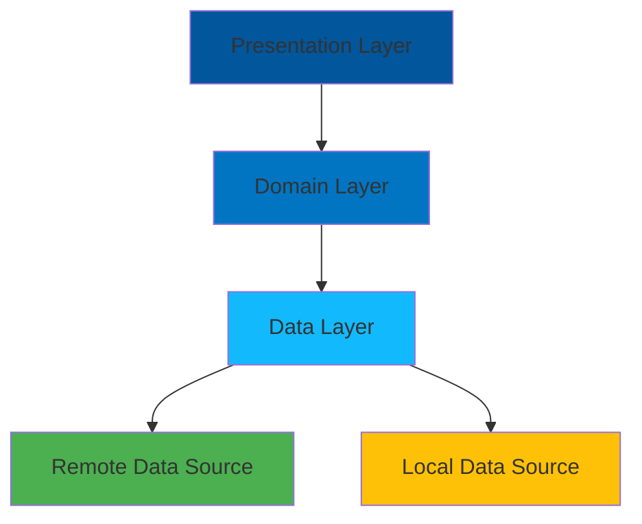

<div align="center">

# Hi there! 👋 I'm Sodiqjon

[](https://www.linkedin.com/in/sodiqjon-maxammadjonov-1784b3345/)
[](your_telegram_url)
[]([your_github_url](https://github.com/sodiqjon-maxammadjonov))

</div>

```dart
class FlutterDeveloper {
    final String name        = "Ibragimov Abdurahim";  
    final String location    = "Uzbekistan";
    final String role        = "Middle Flutter Developer";
    
    final Map<String, List<String>> technicalSkills = {
        'main': [
            'Flutter', 'Dart', 'REST API',
            'Firebase', 'SQLite', 'Provider'
        ],
        'architecture': [
            'Clean Architecture',
            'SOLID Principles',
            'DRY & KISS Principles',
            'BLoC Pattern'
        ],
        'tools': [
            'Git', 'GitHub',
            'VS Code', 'Android Studio',
            'Postman', 'Jira'
        ]
    };

    String get currentFocus => "Building scalable mobile applications";
}
```

## 🎯 Specialization
- **Cross-platform Development** with Flutter
- **Clean Architecture** implementation
- **State Management** with BLoC/Provider
- **API Integration** and Local Storage
- **UI/UX** Implementation

## 💻 Tech Stack

<div align="center">


</div>

## 🌟 Project Architecture



## 📊 GitHub Stats

<div align="center">


</div>

## 💼 Professional Experience
- 4+ Production Level Projects
- Clean and Maintainable Code Architecture
- Team Collaboration and Code Review
- Performance Optimization
- CI/CD Implementation

## 📫 Let's Connect!
- 💬 Telegram: [@your_telegram]
- 📧 Email: sodiqjonmaxammadjonov83@gmail.com
- 💼 LinkedIn: [https://www.linkedin.com/in/sodiqjon-maxammadjonov-1784b3345/]

## 🚀 Current Focus
- Exploring Advanced State Management
- Implementing Clean Architecture
- Enhancing App Performance
- Learning Backend Development

<div align="center">

### 👀 Profile Views


---
⭐️ From [Sodiqjon](https://github.com/sodiqjon-maxammadjonov)

</div>
