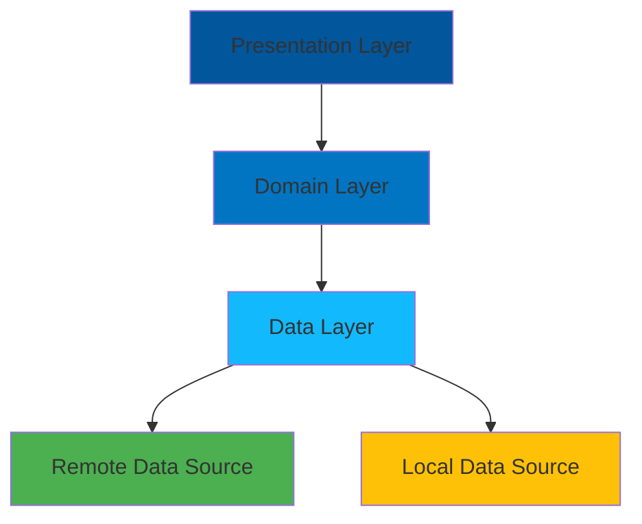

<div align="center">
  
# 👋 Salom, Men Flutter Dasturchiman!

[](sizning_linkedin_urlingiz)
[](sizning_twitter_urlingiz)
[](sizning_medium_urlingiz)

</div>

## 🚀 Men Haqimda

```dart
class Developer {
  final String name = "Sizning ismingiz";
  final String role = "Flutter Developer";
  final List<String> languages = ["Dart", "Python", "JavaScript"];
  
  List<String> getArchitecturePrinciples() => [
    "Clean Architecture",
    "SOLID Principles",
    "DRY (Don't Repeat Yourself)",
    "KISS (Keep It Simple, Stupid)"
  ];
}
```

## 💼 Tajriba
- 4️⃣ ta loyihada faol ishtirok etish
- 🏗️ Clean Architecture va SOLID prinsiplari asosida ishlayman
- 🎯 Toza va samarali kod yozishga e'tibor qarataman

## 🛠 Texnologiyalar & Instrumentlar

<div align="center">


</div>

## 📊 GitHub Statistikasi

<div align="center">
  


</div>

## 🌟 Loyihalarim Arxitekturasi



## 📫 Bog'lanish uchun
- 📧 Email: sizning@email.com
- 💼 LinkedIn: sizning_linkedin_profilingiz
- 🐦 Twitter: @sizning_twitter_profilingiz

## 🎯 Mening Prinsipalarim
- Clean Code yozish
- SOLID prinsiplaridan foydalanish
- DRY va KISS qoidalariga amal qilish
- Doimiy o'rganish va rivojlanish

<div align="center">

### 👨‍💻 Tashrif buyuruvchilar soni


</div>
